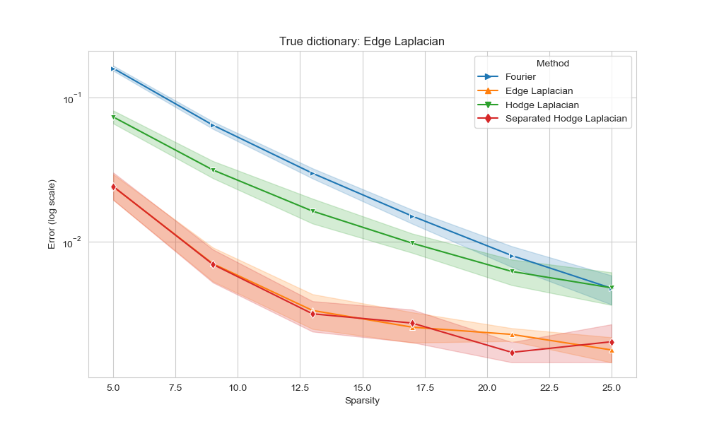

# TSP-DictionaryLearning

## Table of Contents

- [TSP-DictionaryLearning](#project-name)
  - [Table of Contents](#table-of-contents)
  - [Project Description](#project-description)
  - [Project Structure](#project-structure)
  - [Installation](#installation)
    - [Clone the Repository](#clone-the-repository)
    - [Setup Environment](#setup-environment)
    - [Install Dependencies](#install-dependencies)
  - [Usage](#usage)
    - [Running the Simulation](#running-the-simulation)
    - [Customizing Parameters](#customizing-parameters)
  - [Running Tests](#running-tests)

## Project Description

The project I aim to implement a dictionary learning algorithm for sparse representations of a signal on complex regular cellular.

In the project, a "_learnable_" approach is proposed for defining an **overcomplete dictionary of atoms** that can represent the signal in question as a linear combination of only a few atoms in the dictionary.

In fact, the package provides code useful for:
- generate synthetic graph signals of different nature;
- learn a sparse representation of graph signals through the implementation of the dictionary learning algorithm via an **iterative aternating optimization** procedure;
- compare different learning algorithms and empirically demonstrate the generalization capabilities and the advantages given by introducing topological information (via _Hodge theory_) into the algorithm itself.

Take a look at how the code works and plot your own simulation results <a target="_blank" href="https://colab.research.google.com/github/Engrima18/TSP-DictionaryLearning/blob/main/samples/sample.ipynb">
  
</a>

## Simulation Results

Here are the results from our latest simulations. We notice that for different synthetic data (graph signals of different nature) the learning algorithm based on Separated Hodge Laplacian dictionary is always comparable with the other methods. Even if the true signal originates from the other types of dictionaries, the Separated Hodge Dictionary structure imposition actually well performs in recovering the original signal:




*Image 1: Approximation performances on learning Edge-Laplacian-based signal.*


*Image 2: Approximation performances on learning Joint-Hodge-Laplacian-based signal.*


*Image 3: Approximation performances on learning Separated-Hodge-Laplacian-based signal.*


## Project Structure

```bash
TSP-DictionaryLearning/
│
├── tsplearn/       # Package directory
│   ├── __init__.py        # Initializes the package
│   ├── curves_plot.py     # Module file
│   ├── data_gen.py        # Topological signal and dictionary generation
│   ├── model_train.py     # Alternated optimization algorithm for dictionary learning
│   └── tsp_utils.py       # Auxiliary class for graph definition
|   
│
├── samples/        # Examples and sample usage
│   ├── main.py            # Example of complete simulation run
│   └── res.py              # Example auxiliary script for showing and saving results
|   
│
├── results/        # Saved plot figures, notebook environments and variables
│   ├── edge_laplacian/     # Results for 'Edge Laplacian' syntethic signals
│       ├── error.pkl            # Errors values for different learning algorithms
│       ├── ipynb_env.db         # Jupyter notebook environment for main results reproducibility
│       ├── plot.png             # Final results plot for learning strategy comparison
│   ├── joint               # Results for 'Hodge Laplacian' syntethic signals
│       └── ...
│   └── separated           # Results for 'Separated Hodge Laplacian' syntethic signals
│       └── ...
│
├── cache/         # Caching results of intermediate functions
│   └── ...
|
├── tests/         # Unit tests
│   └── ...
│
├── README.md              # Project overview and usage instructions
├── requirements.txt       # Dependencies list
└── setup.py               # Package installation script
```

## Installation

### Clone the Repository

```bash
git clone https://github.com/yourusername/yourrepositoryname.git
cd yourrepositoryname
```

### Setup Environment
It's recommended to use a virtual environment:

```bash
python -m venv venv
source venv/bin/activate  # On Windows, use `venv\Scripts\activate`
```

### Install Dependencies
Install all required dependencies:

```bash
pip install -r requirements.txt
```
## Usage

### Running the Simulation
Navigate to the project directory and run:

```bash
python scripts/main.py
```

### Customizing Parameters
You can customize the simulation with various command-line arguments:

```bash
python scripts/main.py --n_sim 20 --n 40 --p 0.2
```
For more details on available parameters:

```bash
python scripts/main.py --help
```

## Used technologies

